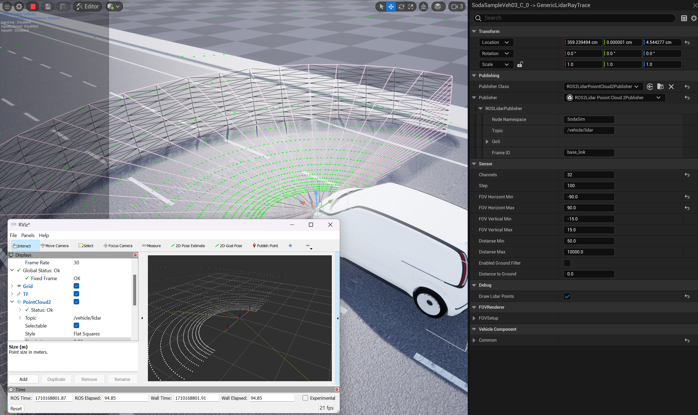
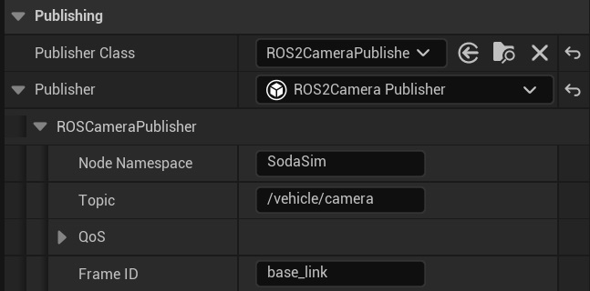

# SODA.Sim ROS2 Plugin 

This repository is a plugin for UnrealEngine and an extension of the [SODA.Sim](https://github.com/soda-auto/SodaSim) plugin to support ROS2 capabilities the for SODA.Sim.
This plugin includes all the necessary precompiled ROS2 dependencies (ROS2 workspace) for windows and linux and does not require any other external ROS2 dependencies.  
Current version of supported ROS2 is **Humble**.  

> [!WARNING]
> For the Linux version supported only FastDDS RMW.

> [!WARNING]
> This is an MVP (Minimum Viable Product) and an experiment to integrate ROS2 with UnrealEngine and SODA.Sim.

## Installing and Using
  - Make sure the [SODA.Sim](https://github.com/soda-auto/SodaSim) is installed.  
  - Clone the plugin to the UnrealEngine Plugins folder or to the your UProject plugins folder. See more information about [Working with Plugins in Unreal Engine](https://docs.unrealengine.com/5.0/en-US/working-with-plugins-in-unreal-engine/). 
  - Download and unzip [ROS2 workspaces](https://github.com/soda-auto/soda-sim-ros2-ws/releases) to the **ros2-linux** or **ros2-windows** folders. 
  
**For Windows:**  
  - Download and install the Win64 OpenSSL v1.1.1 from [this page](https://slproweb.com/products/Win32OpenSSL.html).
  
**For Linux:**  
  - Install depences (TODO: Which?)
  
> [!IMPORTANT] 
> **For Linux Only:**  
> If you you using the plugin with Unreal Editor or using the [Module Build Mode](https://docs.unrealengine.com/5.3/en-US/unreal-build-tool-in-unreal-engine/) you must perform ``` $ source ros2-linux/setup.bash``` every time before start IDE or UnrealEngine or UProject.
  
## What is Currently Implemented
 - The **Generic Camera Sensor Publisher** using [sensor_msgs/msg/Image](https://docs.ros2.org/latest/api/sensor_msgs/msg/Image.html).
 To use it, add the **Generic Pinhole Camera** or **Generic Fisheye Camera** sensor to the vehicle and changle the **Publisher Class** to **ROS2CameraPublisher**.   
 
 - The **Generic Lidar Sensor Publisher** using [sensor_msgs/msg/LaserScan ](https://docs.ros2.org/latest/api/sensor_msgs/msg/LaserScan.html).
 To use it, add the **Generic LiDAR Ray Trace** or **Generic LiDAR 2D Depth** sensor to the vehicle and changle the **Publisher Class** to **ROS2LidarLaserScanPublisher**.
 - The **Generic Lidar Sensor Publisher** using [sensor_msgs/msg/PointCloud](https://docs.ros2.org/latest/api/sensor_msgs/msg/PointCloud.html). To use it, add the **Generic LiDAR Ray Trace** or **Generic LiDAR 2D Depth** sensor to the vehicle and changle the **Publisher Class** to **ROS2LidarPointCloudPublisher**.
 - The **Generic Lidar Sensor Publisher** using [sensor_msgs/msg/PointCloud2](https://docs.ros2.org/latest/api/sensor_msgs/msg/PointCloud2.html). To use it, add the **Generic LiDAR Ray Trace** or **Generic LiDAR 2D Depth** sensor to the vehicle and changle the **Publisher Class** to **ROS2LidarPointCloud2Publisher**.
 - The **Generic Nav Sensor Publisher** using [sensor_msgs/msg/NavSatFix ](https://docs.ros2.org/latest/api/sensor_msgs/msg/NavSatFix.html). To use it, add the **Generic Nav** sensor to the vehicle and changle the **Publisher Class** to **ROS2NavStatFixPublisher**.
 - The **Generic Nav Sensor Publisher** using [nav_msgs/msg/Odometry](https://docs.ros2.org/foxy/api/nav_msgs/msg/Odometry.html). To use it, add the **Generic Nav** sensor to the vehicle and changle the **Publisher Class** to **ROS2OdometryPublisher**.
 - The **Generic Nav Sensor Publisher** using [nav_msgs/msg/Imu](https://docs.ros2.org/latest/api/sensor_msgs/msg/Imu.html). To use it, add the **Generic Nav** sensor to the vehicle and changle the **Publisher Class** to **ROS2ImuPublisher**.
 - The **Generic Wheeled Vehicle Sensor Publisher** using [sensor_msgs/msg/JointState ](https://docs.ros2.org/latest/api/sensor_msgs/msg/JointState.html). To use it, add the **Generic Wheeled Vehicle** sensor to the vehicle and changle the **Publisher Class** to **ROS2WheelsJointStatePublisher**.
 - The **TF publisher sensor** using [tf2_msgs/TFMessage.msg](https://docs.ros.org/en/melodic/api/tf2_msgs/html/msg/TFMessage.html). To use it, add the **TF Publisher** component to the vehicle.
 - The **Generic Wheeled Vehicle Control**  using [ackermann_msgs/msg/AckermannDriveStamped](https://github.com/ros-drivers/ackermann_msgs/blob/ros2/msg/AckermannDriveStamped.msg). Using for control the wheeled vehicle via ackermann messages. To use it, add the **Generic Vehicle Dirver** to the vehicle and changle the **Vehicle Control Class** to **ROS2AckermannControl**.
 
## What Next
 - Support of the [ros2 control](https://control.ros.org/master/index.html) .
 - Support radar and ultrasonic sensors.
 - Add the fully equipped turtlebot model.
 - Add custom messages to control SODA.Sim via ROS2.
 - Support the time sync messages
 - Add CAN/LIN/IO/Serial virtual hardware interfaces
 - Suggest to us what we're missed ?
  
## How to Build ROS2 Workspace Manuly
Usually, you do not need to compile ROS2 from source code, but if you still have a need for this, then below it will be described how to do this for Windows and Linux.

### For for Windows
We don't build ROS2 from source for Windows. We use official prebuiled releases from [here](https://github.com/ros2/ros2/releases). 
  - Perfom all step from [Original Manuale](https://docs.ros.org/en/humble/Installation/Windows-Install-Binary.html#) till to [environment-setup](https://docs.ros.org/en/humble/Installation/Windows-Install-Binary.html#environment-setup).  
    [Downloading ROS-2](https://docs.ros.org/en/humble/Installation/Windows-Install-Binary.html#downloading-ros-2) to the *ros2-windows* folder.  
    Note: You can skip "Install OpenCV", "Install Qt5", "RQt dependencies" steps from the manul.
  - Open *x64 Native Tools Command Prompt for VS 2022*
  - Build and install the [ackermann_msgs](https://github.com/ros-drivers/ackermann_msgs/tree/ros2) to the *ros2-windows* folder:
    ```
    $ call <REPO_ROOT>/ros2-windows/setup.bat
    $ cd <ACKERMAN_MSGS_ROOT>
    $ colcon build --merge-install
    $ cp -a <ACKERMAN_MSGS_ROOT>/Install/. <REPO_ROOT>/ros2-windows/
    ```
  - Build and install the **ros2-ue-wrapper**:
    ``` 
    $ call <REPO_ROOT>/ros2-windows/setup.bat
    $ cd <REPO_ROOT>/ros2-ue-wrapper
    $ colcon build --merge-install --install-base install_win64 --event-handlers console_direct+ --cmake-args -DBUILD_TESTING=OFF 
    ```

### For Linux 
Tested on Ubuntu 22.04 only.  
  - Perfom all step from [Original Manuale](https://docs.ros.org/en/humble/Installation/Alternatives/Ubuntu-Development-Setup.html) till to [Install additional DDS implementations (optional)](https://docs.ros.org/en/humble/Installation/Alternatives/Ubuntu-Development-Setup.html#id8).
  - Copy *Scripts/Build/\** to the ROS2 workspace folder
  - Remove *src/eclipse-cyclonedds* and *src/eclipse-iceoryx* folders
  - Build ROS2:
    ```
	$ export UE_ENGINE=<PATH_TO_UNREAL_ENGINE>/Engine
	$ ./vcpkg-linux.sh
	$ ./BuildForLinux.sh
	$ cp -a Install/. <REPO_ROOT>/ros2-linux/
	```
  - Build and install the [ackermann_msgs](https://github.com/ros-drivers/ackermann_msgs/tree/ros2) to the *ros2-linux* folder:
    ```
    $ source <REPO_ROOT>/ros2-windows/setup.bash
	$ export UE_ENGINE=<PATH_TO_UNREAL_ENGINE>/Engine
    $ cd <ACKERMAN_MSGS_ROOT>
    $ colcon build --merge-install --cmake-args -DCMAKE_TOOLCHAIN_FILE=<REPO_ROOT>/Scripts/Build/unreal-linux-toolchain.cmake
    $ cp -a <ACKERMAN_MSGS_ROOT>/Install/. <REPO_ROOT>/ros2-linux/
    ```
  - Build and install the **ros2-ue-wrapper**:
    ``` 
    $ source <REPO_ROOT>/ros2-windows/setup.bash
	$ export UE_ENGINE=<PATH_TO_UNREAL_ENGINE>/Engine
	$ colcon build --merge-install --install-base install_linux --event-handlers console_direct+ --cmake-args -DBUILD_TESTING=OFF -DCMAKE_TOOLCHAIN_FILE=<REPO_ROOT>/Scripts/Build/unreal-linux-toolchain.cmake 
	```

## Copyright and License
Copyright © 2023 SODA.AUTO UK LTD. ALL RIGHTS RESERVED.  
This software contains code licensed as described in [LICENSE](https://github.com/soda-auto/SodaSim/blob/master/LICENSE.md).  